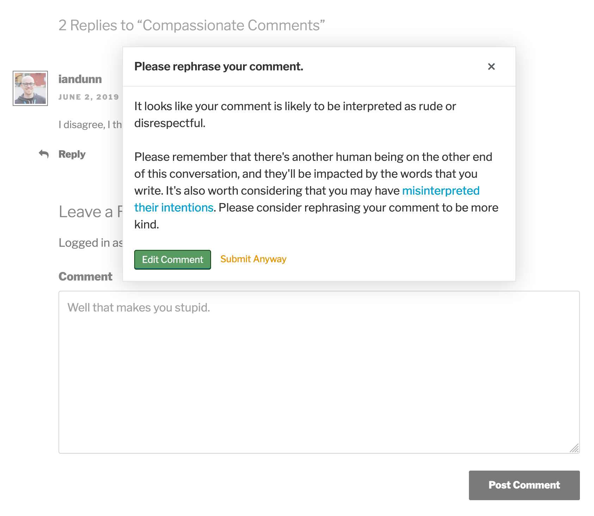

# Compassionate Comments

Why do we have tools to check our spelling, but not to check if we're being kind to each other?

This plugin checks the intent of a comment before it's submitted. If the author is being rude or disrespectful, it will encourage them to think twice, and give them a chance to rephrase their comment to be more kind before they submit it.

Google's free [Perspective API](https://www.perspectiveapi.com/) is used to determine the characteristics of the comment, which means that all comments will be sent to their servers for analysis. You can optionally request that they not store your comments for their future research.

The inspiration for this comes from Tristan Harris' TED talk about [designing technology to reflect human values](https://www.youtube.com/watch?v=D55ctBYF3AY) and from [ReThink](http://www.rethinkwords.com/).

## Example

## Setup

If you just want to **use** the plugin, you can [install the packaged version](https://wordpress.org/plugins/compassionate-comments/) from the WordPress.org plugin repository.

If you want to **develop** the plugin, then follow these steps to setup the development version:

* `git clone https://github.com/iandunn/compassionate-comments.git`
* `cd compassionate-comments`
* `npm install`
* `npm start`

After the initial setup, you only need to run `npm start`. To build the distributed version, run `npm run build`.
